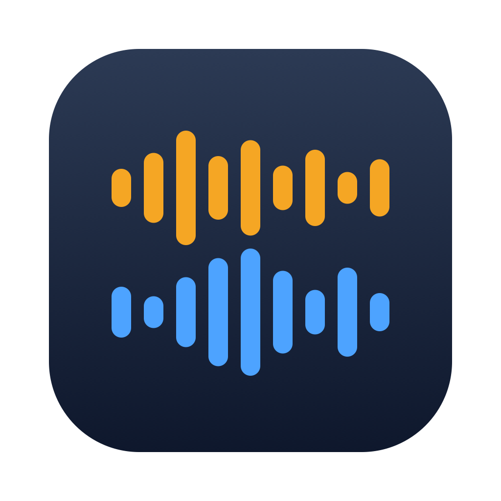

# Debrief



A macOS menu-bar app that records your job-interview calls locally, transcribes
them on-device, and generates candidate-focused coaching feedback — so you walk
into the next round knowing exactly what to fix.

Debrief **never joins the call as a bot.** It captures audio directly from your
Mac — your microphone plus the system audio playing the other participants — so
nothing appears in the meeting's participant list, and works with Zoom, Google
Meet, Teams, or anything else that plays through your speakers.

## How it works

The core trick is **dual-stream capture**. Your mic and the system-audio output
are recorded as two separate streams:

- Everything on the **mic** stream is **you**.
- Everything on the **system-audio** stream is **them** (the interviewer).

That gives perfect two-party speaker attribution with no ML diarization — which
matters, because coaching your answers requires knowing exactly which words are
yours. It's also why capturing at the machine beats a meeting bot: a bot gets one
mixed track and has to guess who's speaking, and its presence is visible to the
interviewer.

```
call detected ──▶ record (mic + system audio, 16 kHz WAV chunks to disk)
                     │
                     ▼
              live transcription (WhisperKit, on-device)
                     │
              stop ──▶ merge streams by timestamp ──▶ [00:03:12] THEM: …
                                                       [00:03:18] YOU:  …
                     │
                     ▼
              coaching debrief (Claude API, or a local model) ──▶ advancement
                                    verdict · scores · weakness tags ·
                                    highlights · action items
```

Audio chunks are flushed to disk **during** capture, so a crash mid-interview
loses nothing — the transcript and debrief are always re-derivable from the
chunks on disk, and Debrief offers to recover an interrupted session on the next
launch.

## Requirements

- macOS 14 or later (Apple Silicon recommended — transcription uses CoreML/Metal)
- Full Xcode installed (the build needs XCTest, which the Command Line Tools alone don't ship)
- A Claude API key for the coaching step (transcription is free and local) — or run coaching fully offline against a local model; see [docs/local-llm.md](docs/local-llm.md)

## Build & run

```sh
git clone https://github.com/bradburch/debrief.git && cd debrief
./scripts/make-app.sh      # release build → Debrief.app
open Debrief.app
```

`make-app.sh` produces a proper `.app` bundle (rather than a bare `swift run`
binary) so macOS attaches the microphone and screen-recording permission prompts
to *Debrief* instead of your terminal.

> **Signing (do this once, before your first build):** create a self-signed
> **Code Signing** certificate named `Debrief Local Signing` — Keychain Access →
> *Certificate Assistant → Create a Certificate…* → Identity Type **Self Signed
> Root**, Certificate Type **Code Signing**. `make-app.sh` signs the bundle with
> it, giving Debrief a code identity that's stable across rebuilds. Without it the
> script falls back to an **ad-hoc** signature whose identity changes every build,
> so macOS keeps re-prompting for your Keychain password and drops the
> Microphone/Screen-Recording grants on each rebuild. No trust step or admin
> password is needed; override the name with `DEBRIEF_SIGN_IDENTITY` if you like.

> **Toolchain note:** every `swift` command must run under the full Xcode
> toolchain, because the Command Line Tools instance has no XCTest. Either run
> `sudo xcode-select -s /Applications/Xcode.app/Contents/Developer` once, or
> prefix commands with `DEVELOPER_DIR=/Applications/Xcode.app/Contents/Developer`.

## First-run setup

1. **Grant permissions.** On first launch macOS asks for **Microphone** and
   **Notifications** (the notification's "Record" action button doesn't work
   without it); the first time you record it asks for **Screen Recording**
   (that's how the other side's audio is captured). Grant all three, then
   relaunch if prompted.
2. **Add your Claude API key.** Open the main window → **Settings**, paste a key
   starting with `sk-ant-`. It's written to a `secrets.json` file under
   Application Support, created with 0600 permissions (readable only by your
   user account) — deliberately not the Keychain, since Debrief's self-signed,
   no-Team-ID signature would make the Keychain re-prompt for your password on
   every rebuild (see `Sources/DebriefApp/SecretStore.swift`). Alternatively,
   export `ANTHROPIC_API_KEY` before launching. Without a key, recordings and
   transcripts still work — debriefs stay pending until a key is set, then
   **Settings → Retry pending debriefs** catches them up.
3. **First transcription downloads a model.** The first time Debrief
   transcribes audio, WhisperKit fetches its speech-recognition model (a
   few hundred MB) from Hugging Face — this needs network access once. After
   that, transcription runs fully offline.

## Using it

- **Record.** When Debrief notices a call starting (a meeting app running and the
  mic in use), the menu-bar icon pulses. Click **Record** — it never
  auto-records. While recording, the popover shows a live level bar for each
  stream; if one stops moving (e.g. AirPods routed system audio somewhere else),
  you'll get a warning mid-call instead of discovering a dead track afterward.
- **Pre-fill from your calendar.** The recording form's **From calendar** menu
  (menu-bar popover and main window both have it) lists your upcoming
  interviews and fills in company, round type, and notes when you pick one.
  Debrief reads this straight from macOS Calendar via EventKit — a local
  system framework, so this is a database read, not a network call, and it
  works with a Google account too as long as it's added in System Settings.
  Turn it on in **Settings → Calendar pre-fill** (grant access, then choose
  which calendar holds your interviews). Without a calendar chosen, the menu
  falls back to `~/Library/Application Support/Debrief/upcoming.json` if that
  file exists — a JSON array of objects:
  ```json
  [{"company": "Acme", "roundType": "technical", "start": "2026-07-20T18:00:00Z", "notes": "Panel round"}]
  ```
  `roundType` and `notes` are optional; `start` is UTC ISO-8601 (whole-second
  `Z` form, e.g. `2026-07-20T18:00:00Z` — fractional seconds also parse).
  Entries from 1 hour ago through 14 days ahead are shown.
- **Stop & debrief.** Tag the session with the company and round type —
  recruiter screen, behavioral, technical, system design, product sense, or
  tech deep dive, or any custom type you've added (round types are just
  markdown files; see below) — hit **Stop & Debrief**, and within a minute or
  two you get a headline verdict (Strong No / Lean No / Lean Yes / Strong Yes —
  the interviewer's would-I-advance call, elicited directly rather than
  computed from the scores) plus per-dimension scores, weakness tags,
  clickable transcript highlights, and concrete action items.
- **Tailor the grading per interview.** Open a session and paste interview-specific
  criteria — a job's published rubric, a leveling guide, "focus on system-design
  trade-offs, this is a staff role" — into **Grading criteria for this interview**,
  then hit **Generate debrief** (or **Regenerate**, once a debrief already
  exists). The model weights your criteria above the built-in
  rubric where they conflict, while still applying the base dimensions, weakness
  tags, and output format. It's scoped to that one recording and doesn't affect
  any other session. The same session view lets you rename the session or
  change its round type inline — changing the round type re-runs the debrief
  against the new rubric automatically.
- **Track progress.** The **Pipeline** view groups sessions by company and round;
  the **Trends** view charts your recurring weakness tags and score dimensions
  over time, so "am I actually improving?" is answerable, not a vibe.
  `overallScore` is a secondary trend line, comparable within a round type but
  not across (different round types score different dimensions).
- **Choose your coaching model.** Settings → Coaching model lets you pick
  Claude Opus (best quality, default), Sonnet (balanced), or Haiku (fastest,
  cheapest) — or switch the provider to a local/OpenAI-compatible server; see
  [docs/local-llm.md](docs/local-llm.md).
- **Export for Claude Cowork.** Settings → Cowork export writes one Markdown
  file per session to a folder you choose, and keeps writing one on every new
  debrief from then on.
- **Keep old debriefs current.** Editing the prompts only affects *new*
  debriefs. Settings → **Retry pending debriefs** catches up sessions that
  never got a debrief (e.g. no API key was set yet); **Re-run debriefs on
  current rubric** re-coaches *every* past session — including already-complete
  ones — against whatever the prompts say today, which is the only way a
  rubric change reaches existing debriefs.

Two layers of prompt control: the **global** coaching prompts are plain markdown,
by default in `~/Library/Application Support/Debrief/prompts/` (configurable in
Settings → Data locations, along with where recordings and the database live) —
edit `base.md` or any round-type overlay to retune every debrief without
rebuilding, or drop in a new `<name>.md` file to add a round type with no code
change — and the **per-interview** grading-criteria box above overrides them
for a single session.

## Privacy

- **Audio never leaves your machine.** Transcription runs fully on-device via
  WhisperKit; raw audio is deleted after a successful transcript by default
  (toggle in Settings). The one exception is a one-time setup step, not an
  ongoing one: the first time you transcribe, WhisperKit fetches its speech
  model from Hugging Face over the network. Once that model is cached, every
  transcription — and your actual interview audio — stays fully offline.
- **Only transcript text** is sent off-device, and only for the coaching step
  — to the Claude API by default, or to whatever local/OpenAI-compatible
  server you've pointed Settings at (which can itself be fully offline; see
  [docs/local-llm.md](docs/local-llm.md)).
- **Calendar pre-fill reads macOS Calendar locally.** If you turn it on, it's
  an EventKit read of the calendar database already on your Mac — no network
  call, no OAuth token, even for a Google account added in System Settings.
- Recording is always an explicit click, never automatic.
- You are responsible for complying with recording-consent laws in your
  jurisdiction — some places require all parties to consent.

## Development

Swift Package, no `.xcodeproj`. Five targets:

| Target          | Responsibility                                        |
| --------------- | ----------------------------------------------------- |
| `CaptureKit`    | Call detection, mic + system-audio recorders, WAV chunking |
| `Transcriber`   | WhisperKit wrapper and two-stream transcript merge    |
| `CoachingEngine`| Prompt assembly, LLM clients (Claude API and local/OpenAI-compatible), coaching service |
| `Store`         | GRDB/SQLite schema, records, and trend/pipeline queries |
| `DebriefApp`    | SwiftUI menu-bar app wiring it all together           |

```sh
# Unit tests (fast; skips the model-download integration test)
DEVELOPER_DIR=/Applications/Xcode.app/Contents/Developer swift test --skip IntegrationTests

# Real end-to-end WhisperKit test (downloads a model on first run)
DEBRIEF_RUN_INTEGRATION=1 DEVELOPER_DIR=/Applications/Xcode.app/Contents/Developer \
  swift test --filter WhisperIntegrationTests
```

Hardware capture paths (mic/screen) can't be unit-tested meaningfully; they're
verified against the checklist in [`docs/manual-test-checklist.md`](docs/manual-test-checklist.md).

The design spec and implementation plan live in [`docs/superpowers/`](docs/superpowers/).

## Status

v1 is feature-complete with a green test suite. The live-call paths
(items 2–8 of the manual checklist) still need a human on a real interview to
sign off — everything up to and including a real on-device transcription of
synthesized speech is automated and passing.
